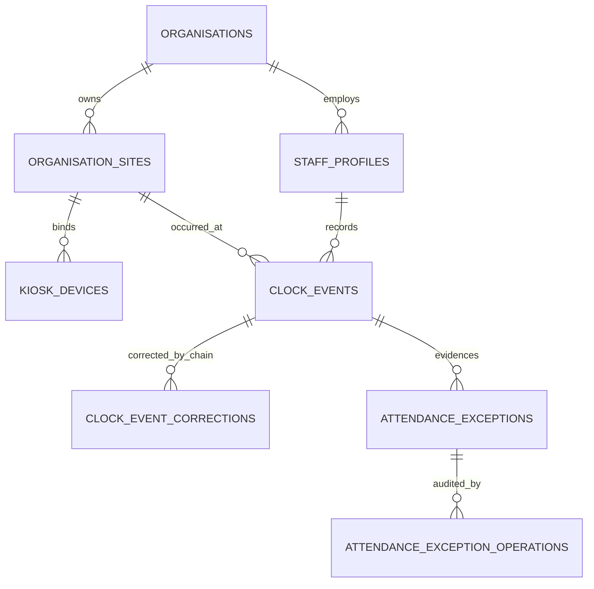
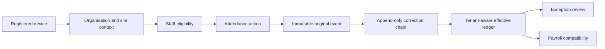

# Attendance Tenancy

Status: implemented in Workstream 5 on `codex/commercial-production` only.

This milestone makes new commercial attendance organisation-owned and occurrence-site-owned. It does not backfill Jan, convert payroll, enable offline attendance, deploy, or connect to Jan production.

## Ownership model

Every new commercial attendance row carries `organisation_id` and `site_id`. Composite foreign keys fence staff, sites, devices, original events, correction chains, exceptions and operations inside the same organisation and occurrence site. Evidence relationships use `ON DELETE RESTRICT`. Ownership triggers reject partially owned rows, commercial staff on the unowned path, legacy staff on the commercial path, and later owner or site reparenting.

The event site is a historical snapshot. A later staff transfer, site-access change, device retirement or attempted device rebind cannot change it. Manager-added evidence requires an explicitly selected permitted site. Corrections inherit the target evidence site and cannot supersede a correction at another site.

## Authoritative flow

Kiosk roster, PIN verification, temporary PIN change and attendance-action dispatchers look up the hashed device token and choose the commercial or explicit legacy path. Commercial RPCs derive the organisation, site and device identifier from that row; no browser-supplied organisation or site is accepted. They then validate same-organisation staff ownership, an effective site assignment, PIN status, the expected revision and the requested transition. Direct execution of the superseded global kiosk mutation functions is revoked. Offline authorisation is neither created nor enabled.

Manager commands resolve the current membership in the server action and repeat permission, membership, staff and site checks inside guarded database functions. Corrections require `attendance.correct`, AAL2, a reason, operation UUID and expected revision. Reviews and dismissals require `attendance.review`; resolution requires `attendance.correct`. Retries return the stored safe result only when the full request identity matches.

## Ledger, locks and exceptions

`private.get_commercial_effective_clock_events` is the privileged source and `public.get_commercial_effective_clock_events` is its narrow authorised facade. It keeps originals available for audit, selects only correction-chain leaves, excludes superseded or excluded evidence, and returns organisation/site on every effective event. Queries are scoped by organisation, site, staff and London recorded date, so pairing cannot cross a tenant, occurrence site or operational day.

Attendance stream advisory locks use organisation plus staff identity. Kiosk request records also bind organisation, site, device, staff, action and revision to the idempotency UUID. Changed replays fail closed. Manager correction and exception operations use the same stream lock and optimistic revision, preventing a stale preview from overwriting concurrent evidence.

Reconciliation creates tenant/site-scoped anomaly fingerprints. Repeated runs do not duplicate open issues. Resolution appends a correction and an exception operation; dismissal appends an operation and requires a reason. Resolved and dismissed evidence is retained.

## RLS and RPC boundary

Commercial reads require an active same-organisation membership and either organisation-wide attendance permission, permitted-site attendance permission, or a linked same-organisation staff identity reading its own row. Site managers therefore see only authorised sites. Revocation is evaluated on each request. Commercial mutations are denied directly for authoritative evidence and audit tables.

All new privileged helpers use an empty `search_path` and fully qualified relations. `PUBLIC` execution is revoked. Kiosk verification/action dispatchers are granted only to `anon` and `authenticated`; manager, state and ledger RPCs are granted only to `authenticated`; private helpers are not callable through the API. Billing entitlements are not part of RLS.

## Explicit Jan compatibility

Unowned Jan rows remain `organisation_id IS NULL AND site_id IS NULL`. Named legacy RLS policies and the tenant-aware kiosk dispatcher keep those rows operational. A commercial identity failure other than `membership_required` never falls back to `staff_accounts`; ambiguous selection, unavailable site and denied permission fail closed. No migration guesses ownership or rewrites timestamps, hashes or correction chains.

Removal conditions:

- Remove the unowned attendance policies only after a controlled Jan rehearsal proves every original, correction, review, request and exception has a verified organisation/site mapping and unchanged evidence counts and hashes.
- Remove the legacy kiosk dispatcher branch only after every Jan device is tenant/site bound and its online workflow passes production-equivalent smoke tests.
- Remove the `staff_accounts` attendance actor fallback only after Jan managers and staff have converted memberships and linked profiles.
- Contract ownership columns to `NOT NULL` only after no unowned compatibility rows remain and validated constraints pass.

Operational rollback means reverting the application SHA while retaining this additive schema and all evidence. Do not reverse the migration destructively.

## Workstream 6 payroll dependencies

Payroll tenancy must consume the tenant-aware effective ledger with organisation, occurrence site, staff and operational date, then tenant-scope pay periods, adjustments, approvals, exports and readiness queries. It must preserve existing minute totals, avoid reimplementing correction resolution, and compare old and new outputs before any Jan migration. This milestone does not add or change pay calculations, pay tables, tax logic or exports.

Planned-hours application and reset remain disabled for commercial attendance until rota tenancy provides an authoritative organisation/site planned-hours source. Managers can still add, replace or exclude attendance evidence through tenant-aware correction commands. Jan continues using its existing planned-hours compatibility commands.

The later Jan migration rehearsal must inventory unowned rows, construct evidence-backed site mappings, test on an isolated copy, compare raw-event hashes and correction ancestry before and after, validate every composite constraint, confirm zero offline-enabled devices, and require explicit approval before any production write.
