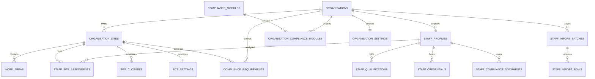

# Customer Domain Conversion

Status: implemented in Workstream 4 on `codex/commercial-production` only.

This milestone converts staff, compliance, settings, work areas, site closures and staff imports to the commercial organisation/site boundary. It is additive. It does not backfill Jan, change attendance or payroll calculations, convert kiosk devices, deploy, or connect to Jan production.

## Domain model

Every commercial staff-owned record carries `organisation_id`. Site-local records also carry `site_id`. Composite foreign keys prevent a staff profile, site, requirement, membership actor or import result from being attached across organisations. `staff_site_assignments` is the authoritative commercial employment-to-site relationship and supports multiple concurrent sites, inclusive effective dates, one non-overlapping primary assignment and future transfers.

## Database conversion

`20260806001816_customer_domain_conversion.sql`:

- adds nullable organisation ownership to qualifications, certificates, central-record compatibility tables, reference checks, legacy import reviews and staff pay arrangements;
- derives commercial child ownership from the referenced staff profile and rejects mismatched client ownership;
- makes organisation and owning-parent identifiers immutable after creation, including for users authorised in more than one organisation;
- replaces global staff email uniqueness with legacy-only and per-organisation uniqueness;
- introduces neutral compliance modules, requirements, credentials and private-document metadata;
- introduces site-owned work areas and closures;
- extends organisation defaults and site overrides for operating and staffing settings;
- introduces previewable, validated, idempotent staff import batches and rows;
- provides atomic staff creation and import commit commands that create the initial site assignment;
- adds indexed RLS predicates for organisation permission, site permission and linked-staff self access.

No inherited Jan row is assigned an organisation by this migration. Only records already linked to an organisation-owned commercial staff profile receive derived ownership. Existing unowned rows remain `organisation_id = null`.

## Staff and staff-account compatibility

Commercial staff creation uses `create_commercial_staff_profile(...)`. The command reloads the current membership in the database, validates `staff.manage` for the target site, requires AAL2 and inserts the staff profile and initial `staff_site_assignments` row in one transaction. The browser does not choose the organisation independently of the server-selected membership.

`staff_accounts` remains the Jan compatibility account table. It is not the commercial tenant authority and was not removed or made multi-organisation. Commercial identity continues to use `auth.users`, `organisation_memberships`, optional same-organisation staff linkage, roles and site access. The new staff action and repositories use membership-derived context; legacy actions remain available for unowned rows until their dependent attendance, payroll and kiosk paths are converted.

Commercial staff profiles cannot be inserted directly through the Data API. Creation must use the atomic command so every profile begins with an authoritative site assignment. Compliance and settings actions first resolve current commercial membership authority and fall back to `staff_accounts` only when the authenticated identity has no commercial membership. Permission denial, ambiguous organisation selection and stale commercial state never fall back. Commercial verification/check audit fields reference the acting membership through same-organisation composite keys.

## Compliance modules

The core capability catalogue contains only:

- qualifications;
- credentials;
- requirements;
- documents.

DBS, safeguarding, central-record tracking and sector-specific training remain inside the nursery, care-home, clinic and tuition-centre packs. Existing `staff_certificates` and central-record tables remain compatibility storage. New commercial records can use neutral `staff_credentials`, `compliance_requirements` and `staff_compliance_documents`. Document rows store private object paths, not public URLs or document contents.

Organisation-level compliance permissions may view organisation requirements. Site requirements require permission at that site. Linked staff may read their own ordinary qualification and credential status. Central-record compatibility, reference and document metadata require compliance-management authority and are not exposed through ordinary self-service.

## Settings and site operations

Organisation settings hold defaults. Site settings hold only explicit overrides. Resolution is field-by-field, so a missing or `null` site value inherits rather than erasing the organisation default. Existing `rota_settings` remains the Jan compatibility source and is not migrated.

`work_areas` is the stored core concept. Industry profiles present it as Room, Unit, Classroom or Department. Existing `room_or_area`, `available_rooms` and synchronisation triggers remain compatibility aliases. `site_closures` provides a normalised, effective date-ranged site calendar; existing settings arrays are retained until their consumers are converted.

## Staff imports

The TypeScript preview validates and normalises fictional or customer-supplied rows without writes. It uses strict calendar validation and organisation-bound, collision-safe derived identifiers. The database preview command records an organisation/site-bound batch and per-row validation outcomes. Each row must name the authorised target site. Email addresses are validated, lower-cased and carried through the atomic commit. Its idempotency key is bound to the canonical request payload and site; batch creation uses the database uniqueness constraint atomically so concurrent retries resolve to the same batch. A key cannot be reused with changed rows or at another site. Missing dates, malformed booleans, site mismatches, duplicate email addresses and previously imported external keys become row errors rather than deferred commit failures. Commit requires the same current tenant authority and AAL2, accepts only a fully valid preview, and creates staff plus initial assignments atomically. Any failing row rolls back the whole commit. Imports do not create Auth users, memberships, invitations, attendance, kiosk access or pay records.

## Compatibility and remaining paths

The following remain deliberately compatible after Workstream 5:

- unowned `staff_profiles` and related compliance rows use the legacy manager/staff RLS path;
- `staff_accounts` remains for Jan authentication consumers;
- `staff_certificates`, `staff_central_records`, `staff_central_record_items`, `staff_reference_checks` and `staff_import_reviews` remain available while neutral commercial tables are adopted;
- `rota_settings`, legacy room columns and closure arrays remain readable;
- staff pay arrangements carry organisation ownership, but payroll calculation, preparation, import, export and reports remain unconverted;
- unowned Jan attendance and device rows remain on named compatibility paths; new commercial originals, corrections, reviews, requests, exceptions and minimum online device bindings are organisation/site owned as documented in `attendance-tenancy.md`;
- payroll and offline attendance records remain unchanged.

The existing staff directory, staff detail and compliance screens continue through their legacy `staff_accounts`-compatible loaders because those screens currently aggregate attendance, payroll and kiosk data that are explicitly outside this workstream. Workstream 4 adds membership-authorised commercial commands, repositories and settings UI selection without pretending those mixed legacy screens are fully tenant-converted. Their customer-facing adoption must happen alongside the relevant attendance, payroll and kiosk conversions, using the adapters established here.

Legacy policies are limited to `organisation_id is null`. A legacy Jan manager cannot use those policies to read or modify commercial rows. Commercial policies cannot use an unowned row as customer data.

## Migration and rollback notes

Apply this migration only after Tenant Primitives and Identity and Membership Conversion. It is forward-only and additive. A rollback should return the application to the prior SHA while preserving the added tables, columns and customer evidence. Do not drop columns or tables as an operational rollback.

Jan migration remains a separate controlled workstream. It must establish the Jan organisation and sites, map every inherited operational row, temporarily use an approved backfill path around the ownership-immutability guards, restore those guards, compare evidence hashes and counts, and receive explicit production approval.

## Workstream 5 boundary

Workstream 5 is Attendance Tenancy. Its exact implementation scope is to add immutable organisation and occurrence-site ownership to attendance aggregates and original clock events, corrections and exceptions; tenant-fence all attendance RPCs, manager review and self-service reads; preserve original evidence and correction chains; and retain a tested Jan compatibility path. It must not include payroll tenancy, billing, onboarding, Jan production migration or offline enablement. Kiosk-device tenancy and device-bound authorisation remain a separately approved part unless the Workstream 5 brief explicitly includes them.

No Workstream 5 implementation is included in this milestone.
