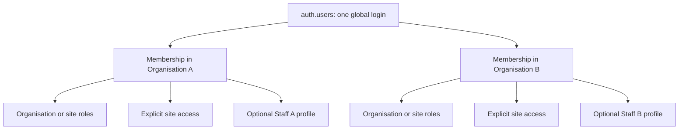

# Identity and Membership Conversion

Status: implemented in Workstream 3 on `codex/commercial-production` only.

Supabase Auth answers who signed in. Organisation membership answers which customer accounts that identity may enter. Role assignments and explicit site access answer what it may do. The optional same-organisation staff link answers which employee record represents the identity. None of these concerns substitutes for another.

## Request resolution

1. The server validates the current user with Supabase Auth and reads the session AAL.
2. `current_commercial_identity_snapshot()` reloads only that Auth user's memberships, current roles, site access, linked staff ID, database-derived permissions and authorisation revision.
3. The signed HTTP-only preference supplies only a membership ID, optional site ID and last-seen revision.
4. `resolveMembershipContext()` verifies the preference against the fresh snapshot. Multiple active memberships require explicit selection. Suspended, revoked, archived and stale selections fail closed.
5. Guards require the current permission, selected-site permission, staff link or AAL2 as appropriate.

The snapshot is request-local and is not cached across requests. Navigation can display briefly stale state, but a sensitive action always reloads the database snapshot. Role, site-access, staff-link and membership-status changes increment `authorisation_revision`, so an old preference cannot authorise a mutation. Organisation and site IDs supplied by a browser are routing hints only.

## Organisation selection

`/organisations/select` is the minimal testable selector. Its cookie is versioned, HMAC-SHA-256 signed, HTTP-only, `SameSite=Lax`, secure outside local development and contains no role, permission, email or AAL. Switching organisation writes a preference with `siteId = null`. Only fixed local continuation routes are accepted, preventing open redirects.

If there is no active membership, no organisation is selected. One active membership may be resolved automatically by server context. Multiple active memberships fail closed until explicitly selected. An inaccessible stored membership produces a re-selection state rather than silently changing the organisation during a sensitive operation.

## Roles, sites and MFA

Permission unions come from the private database catalogue, not browser values or Auth metadata. Organisation roles contribute their approved permissions across active sites. Site-scoped roles contribute only when the same membership also has unrevoked access to that site. Site access by itself grants nothing.

Organisation owners, organisation administrators, HR administrators, payroll administrators and site managers require AAL2 for privileged acceptance and mutations. `requireAal2()` returns the safe `mfa_required` contract. `/mfa` is deliberately a foundation route; enrolment and challenge UX remains deferred.

## Lifecycle and invitation acceptance

Invited memberships have no active context. Suspension and revocation take effect on the next request without waiting for JWT refresh. Membership rows, staff links and customer evidence remain. Status transitions append to `membership_status_events`; authenticated clients cannot update or delete that evidence.

Invitation tokens are stored only as SHA-256 hashes and are expiring and single-use. `accept_organisation_invitation(token)` validates the authenticated email, current organisation, current inviter authority, stored role and site intent, composite site ownership and AAL2 where required in one transaction. The browser cannot submit roles or sites. Same-user retry is idempotent; duplicate active membership, expired/revoked token, email mismatch and authority loss return neutral outcomes. A replacement invitation supersedes an older pending token for the same organisation and email.

## Legacy compatibility and removal

`toLegacyAccountCapability()` is the only new compatibility mapper. It maps a single unambiguous active commercial membership with approved management permissions to legacy `manager`, or an active linked staff membership to legacy `staff`. It never chooses the first of several organisations.

Inherited `staff_accounts` remains in `src/lib/auth/actions.ts`, `src/lib/auth/permissions.ts`, `src/lib/accounts/server.ts`, `src/lib/leave/server.ts`, `src/lib/payroll/server.ts` and `src/lib/kiosk/server.ts`. Compliance repositories now accept an optional server-derived commercial context but still retain the legacy account status path for unowned Jan rows.

Workstream 4 adds tenant ownership and membership-aware conversion for staff, staff-site assignments, compliance, settings, work areas, site closures and imports. Its exact compatibility boundary is recorded in `docs/commercial/customer-domain-conversion.md`. Attendance, payroll processing, kiosk tenancy, onboarding, billing, offline changes and Jan migration remain excluded.
