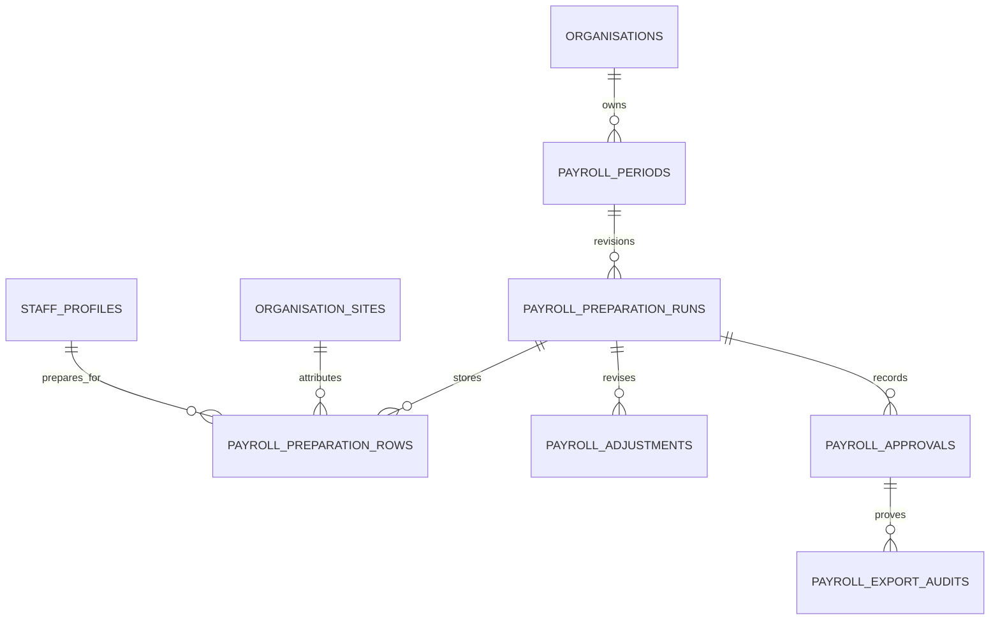
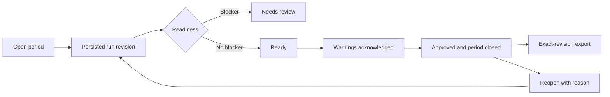

# Payroll and Reporting Tenancy

Status: implemented in Workstream 6 on `codex/commercial-production` only.

This milestone converts commercial payroll preparation, review, adjustments, imports, reporting and exports to an organisation-owned ledger. It preserves the separate Jan Pre-School legacy path. It does not backfill Jan ownership, change original attendance evidence, deploy, connect to Jan production, enable offline attendance or implement Workstream 7.

Payroll remains pay preparation only. Amounts are estimated or manager-entered preparation values, not payslips or a statutory payroll calculation.

## Ownership and site attribution

`payroll_periods`, preparation runs and rows, adjustments, approvals and export audits require `organisation_id`. Composite organisation keys fence period, run, staff, pay-arrangement, membership actor and optional site relationships. Ownership cannot be reparented after creation. A site is historical occurrence attribution and an authorised reporting filter, never the tenant boundary. A selected commercial site must belong to the organisation and be accessible to the current membership.

The commercial snapshot consumes the Workstream 5 effective-attendance ledger. It retains the event's occurrence site and London operational date, so a later staff transfer does not alter earlier payroll attribution. Original clock events and their append-only attendance correction chains remain the source evidence; the payroll migration does not update or delete either.

## Preparation lifecycle and evidence freshness

Periods are organisation-scoped and idempotent by operation ID and date range. A persisted run records an immutable revision with stored rows, readiness counts and five SHA-256 values: submitted input, submitted attendance, submitted pay arrangements, authoritative attendance and authoritative pay arrangements. The application canonicalises sorted input before hashing; database commands independently rebuild authoritative evidence and pay-arrangement fingerprints.

The central readiness result classifies missing clock-in/out, malformed sequences, unresolved exceptions, unreviewed days, pending requests, long shifts, missing site attribution, missing pay arrangements, stale input and manager corrections as blocker, warning or informational. Approval requires the current revision to be unblocked, its warnings acknowledged and its authoritative fingerprints unchanged. Reopening needs a reason and creates a new auditable revision. Earlier runs, approvals and exports remain retained rather than overwritten.

## Adjustments, imports and exports

Payroll adjustments are distinct from attendance corrections. A commercial adjustment has a signed minute value, reason, staff, optional same-organisation site attribution, actor membership, operation ID and expected revision. It creates a new payroll revision and changes only stored payroll preparation rows. It never rewrites a clock event or a clock-event correction.

Commercial pay-arrangement imports are previewed and reviewed before an atomic commit. Commercial batches and review rows are organisation-owned, can carry validated site metadata and use organisation-scoped idempotency receipts. Every mapped staff member and optional site is checked within the organisation. A malformed or unconfirmed row prevents the whole commit; no partial commercial pay arrangements are written.

Exports are allowed only from an approved, closed exact revision. The server validates the requested site against the run's stored site filter, loads stored authorised rows rather than a transient recalculation, produces a neutral organisation/site-labelled workbook, formula-safes workbook strings and records an export audit receipt. The receipt binds organisation, period, run, approval, revision, operation ID, format, site filter, file name, SHA-256 digest, row count and filter metadata. A later change creates a new revision and cannot alter a historical export receipt.

## Authorisation and data boundary

Commercial reporting reads require `payroll.read`. Preparation, acknowledgement, approval, reopening, adjustment and commercial import actions require `payroll.prepare`; export creation and its audit receipt require `payroll.export`. Server actions resolve the active membership and selected site afresh, then database commands repeat organisation, permission, site and revision checks. Privileged commercial mutations require AAL2 both in the application guard and guarded database RPC.

RLS permits commercial reads only through current organisation payroll permission. Direct browser mutations to commercial ledger tables are not granted. Guarded public command RPCs have narrow `authenticated` execution grants; private helpers are not API-callable, use a fixed empty `search_path` and fully qualified relations. Operation IDs are organisation-scoped and request digests prevent a retry from being reused with changed content. The kiosk has no payroll route or pay-rate data.

## Explicit Jan compatibility

`resolvePayrollActor()` chooses the commercial path first. It can select the Jan compatibility adapter only when commercial resolution returns the safe `membership_required` outcome. Ambiguous membership selection, unavailable site, revoked membership, missing permission and AAL failure fail closed and never fall back to a `staff_accounts` manager.

| Surface | Commercial path | Retained Jan path |
| --- | --- | --- |
| Payroll pages | `/payroll`, `/payroll/review` and `/payroll/arrangements` load membership-scoped commercial state and actions. | The same entry points retain their existing `requireAccount` manager-backed screens for unowned Jan data. |
| Payroll export | `/payroll/export` requires a stored approved commercial revision and records an audit receipt. | The route retains the existing manager export behaviour for the explicit Jan actor. |
| Payroll imports | Commercial preview, review, ready and commit RPCs own batches and rows by organisation. | `apply_legacy_payroll_import_batch` is limited to an unowned Jan batch and a legacy-only manager actor. |
| Attendance input | Uses organisation/site effective-ledger evidence. | Existing unowned Jan attendance loaders and payable-minute calculation remain in their named legacy adapter. |

Existing Jan payroll import batches and review rows remain `organisation_id IS NULL` and, where applicable, `site_id IS NULL`. Legacy policies are limited to those unowned rows. Commercial calls cannot use the legacy import command, and the legacy command rejects commercial batches. No migration guesses an organisation or site, changes a historical hourly rate or salary value, rewrites attendance timestamps or hashes, or converts Jan data as part of this work.

Removing this contract requires a separately approved Jan migration rehearsal with verified organisation/site mappings, unchanged raw-event hashes and correction ancestry, evidence counts, imports, exports and manager workflow results. Only then may legacy policies, adapters and nullable ownership be considered for removal.

## Exclusions and Workstream 7 boundary

This implementation does not calculate or submit PAYE, National Insurance, pensions, statutory pay, deductions, tax codes, payslips or HMRC submissions. It does not create billing, entitlement or onboarding behaviour. Offline attendance, offline authorisation and offline roster provisioning remain disabled; payroll readiness continues to reject unresolved attendance evidence rather than treating offline data as authoritative.

Workstream 7 has not begun here. Its exact boundary is the separately approved commercial onboarding and go-live work described in [`docs/superpowers/specs/2026-08-05-commercial-onboarding-go-live-design.md`](../superpowers/specs/2026-08-05-commercial-onboarding-go-live-design.md). This payroll milestone neither creates onboarding architecture nor authorises organisation creation, invitations, billing, Jan migration, production deployment or offline enablement. Any Workstream 7 change must be separately scoped and must preserve this payroll and Jan compatibility contract.
