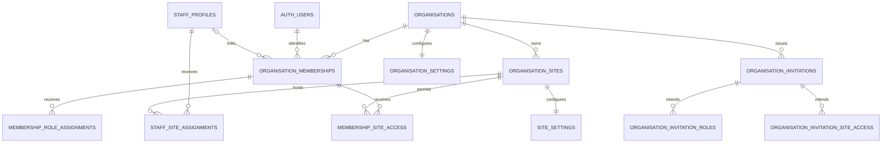

# Tenant Primitives

Status: implemented in Workstream 2 on `codex/commercial-production` only.

This milestone establishes the tenant boundary for later commercial work. It does not migrate existing operational data, make tenant ownership mandatory on inherited tables, create onboarding or billing, or change attendance and payroll behaviour.

## Relationship model

All relationships that cross a tenant-owned table use `(organisation_id, id)` composite references. This prevents a valid identifier from another organisation being attached accidentally or maliciously. Membership site access is separate from role scope: a site-scoped privileged action requires both an applicable role assignment and active access to that site.

## Migration inventory

`20260805195409_tenant_primitives.sql` performs one additive migration:

1. Creates tenant, membership, role, scope and invitation status enums.
2. Creates organisations and sites.
3. Adds nullable `staff_profiles.organisation_id` plus a composite unique key.
4. Creates memberships, fixed role assignments and site access.
5. Creates effective-dated staff-to-site assignments.
6. Creates organisation and site settings.
7. Creates invitation headers with normalized role and site children.
8. Adds relational fences, indexes, lifecycle triggers, private authorization helpers and RLS.

The migration must run after all inherited Jan migrations. It does not update existing rows and is not reversible destructively.

## Authorisation helpers

The stable database interfaces are:

- `private.current_membership_id(organisation_id)`
- `private.current_membership(organisation_id)`
- `private.is_active_member(organisation_id)`
- `private.has_permission(organisation_id, permission)`
- `private.has_site_permission(organisation_id, site_id, permission)`

These functions validate `auth.uid()` against current relational state on every call. They are `SECURITY DEFINER` only to avoid RLS recursion, use an empty fixed search path, fully qualify referenced objects, and expose only a membership UUID or boolean result. Execution is revoked by default and granted explicitly to `authenticated`; the role-permission catalogue and trigger functions remain private.

The fixed roles are organisation owner, organisation administrator, HR administrator, payroll administrator, site manager, scheduler and staff. Organisation roles can authorise permitted work across the organisation. A site role is effective only for its assigned site and an unrevoked `membership_site_access` row. The last active organisation owner cannot be suspended, revoked or stripped of the owner role.

## Initial RLS surface

RLS is enabled on every new public table. Anonymous access has no grants. Authenticated access uses explicit grants and policies:

- organisation rows require active membership;
- site rows require site permission;
- membership and invitation administration requires membership permissions;
- staff assignments and local settings require permission at that site;
- tenant-owned writes validate the target organisation and site server-side;
- no authenticated direct-delete grant is introduced.

Later service commands may narrow direct writes further, but must use these same database boundaries. Entitlements are deliberately not part of RLS and cannot establish tenant identity.

## Compatibility boundary

Existing `staff_profiles` rows remain unchanged with `organisation_id = null`. The TypeScript field is optional and nullable for the same reason. No current repository, route, attendance table, pay table, kiosk flow or report has been converted. This is a deliberate bridge, not a tenant-ready claim for inherited operational data.

A later separately approved ownership-conversion workstream must provide the controlled migration and validation that assigns inherited records to an organisation and the appropriate sites before making ownership mandatory. Until then, new tenant primitives must not be used to imply isolation for inherited operational tables.

Workstream 3 now supplies membership-aware identity resolution and invitation acceptance, but it intentionally does not backfill or make inherited operational ownership mandatory. See `docs/commercial/identity-and-membership.md`.

## Verification harness

`tests/helpers/tenant-primitives-db.ts` creates two unrelated organisations, three sites and several membership shapes in an ephemeral PostgreSQL-compatible database. `tests/tenant-primitives-db.test.ts` proves tenant-separated reads and writes, composite-key integrity, site-scoped permissions, revoked-membership denial, owner continuity and assignment rules. It contains no production credentials or project references.

## Explicitly deferred

- Existing Jan data backfill and mandatory ownership.
- Operational-table tenancy and RLS conversion.
- Attendance, rota, leave, compliance, kiosk and payroll migration.
- Organisation creation commands, onboarding and invitations workflow.
- Billing, subscription and entitlement enforcement.
- Offline attendance.
- Customer-facing tenancy UI and platform-support access.
