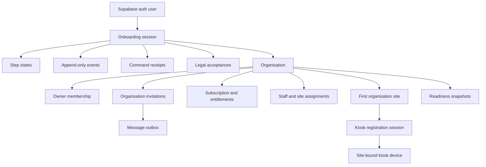

# Commercial Onboarding and Go-Live Architecture Specification

**Status:** Approved design recorded for review

**Date:** 5 August 2026

**Branch:** `codex/commercial-production`

**Authority:** Extends `2026-08-04-commercial-multitenant-saas-design.md`

## 1. Purpose

This specification defines the first-run experience that takes a new nursery customer from owner registration to safe live attendance without developer assistance. It is a first-class commercial subsystem, not an invitation form or a collection of client-side screens.

The design uses a durable, server-authoritative relational workflow with append-only onboarding events, idempotent commands and readiness derived from authoritative organisation, site, staff, subscription and kiosk state.

This document specifies architecture and a later implementation workstream only. It does not authorise application code, database schema, environment, deployment or Jan production changes.

## 2. Relationship to the commercial tenancy specification

The approved commercial multi-tenant architecture remains authoritative. In particular:

- `organisation` is the customer and primary tenant boundary;
- the first nursery premises is an `organisation_site`;
- the owner receives an active `organisation_membership` and organisation-scoped owner role;
- all customer-owned operational records carry `organisation_id`;
- site-specific records also carry `site_id` and composite tenant fences;
- membership, permission, invitation, billing and kiosk rules from the parent specification apply throughout onboarding;
- RLS remains the tenant-isolation boundary;
- entitlements control commercial capability, not tenant identity or row visibility;
- kiosk devices are bound to exactly one site; and
- offline attendance remains disabled and excluded from this workflow.

If this document conflicts with the approved tenancy boundary, the tenancy specification wins. The onboarding implementation must then be revised before release.

## 3. Approved decisions

1. Onboarding is a durable workflow, not a browser-local form.
2. Each material operation is a server command with an idempotency key and expected workflow revision.
3. Successful steps commit independently at safe transaction boundaries. There is no single fragile final transaction.
4. Onboarding events are append-only and contain no secrets or unnecessary personal information.
5. Readiness is calculated from live authoritative records. A checked box cannot make an unsafe organisation ready.
6. A valid free trial can Go Live without payment details.
7. The trial includes complete core attendance operation.
8. Trial expiry or payment failure never deletes evidence, changes recorded time, blocks a necessary clock-out or removes customer access to their data.
9. Commercial restrictions apply primarily to growth and premium capabilities.
10. Initial rota setup is optional and has no readiness weight.
11. Additional sites use a separate expansion workflow that reuses onboarding modules.
12. Production mode never falls back to demo data after an onboarding failure.

## 4. Scope and non-goals

### 4.1 In scope

- owner identity verification, MFA and legal acceptance;
- organisation and first-site creation;
- trial or paid subscription selection;
- organisation and site settings;
- staff creation by CSV, manual entry or a deliberate skip path;
- manager and staff invitations;
- site-bound online kiosk registration and connection testing;
- PIN policy readiness;
- optional initial rota guidance;
- readiness evaluation, Go Live and resume behaviour;
- failure recovery, help, accessibility and onboarding analytics;
- multi-site extension boundaries; and
- entitlement, grace and restricted-mode behaviour.

### 4.2 Non-goals

- implementation code or executable migrations;
- changing Jan production or its deployment;
- offline kiosk provisioning or offline attendance;
- white-label or reseller onboarding;
- custom customer roles in the first commercial release;
- biometric attendance;
- tax, PAYE, National Insurance, pensions or payslips; and
- automatically creating payroll data from unreviewed onboarding input.

## 5. Domain model

### 5.1 Onboarding session

`onboarding_sessions` is the durable workflow aggregate.

Required fields:

- `id uuid primary key`;
- `owner_auth_user_id uuid not null`;
- `organisation_id uuid` nullable until organisation creation;
- `workflow_key text not null`, initially `commercial_customer_v1`;
- `workflow_version integer not null`;
- `status text not null` constrained to `not_started`, `in_progress`, `needs_attention`, `ready`, `live`, `abandoned`;
- `current_step_key text not null`;
- `revision bigint not null default 0`;
- `started_at timestamptz not null`;
- `last_activity_at timestamptz not null`;
- `ready_at timestamptz`;
- `go_live_at timestamptz` immutable once set;
- `completed_by_membership_id uuid` nullable; and
- standard created and updated timestamps.

Only one non-abandoned commercial customer onboarding session may exist for an owner and organisation combination. Before organisation creation, one active bootstrap session is allowed per owner identity. Once the organisation is created, linking the session to it is part of the same transaction.

The session stores navigation and lifecycle state. It does not duplicate organisation settings, subscription status, staff counts, invitation status or kiosk health.

### 5.2 Step state

`onboarding_step_states` stores durable progress for each workflow step.

Required fields:

- `id uuid primary key`;
- `session_id uuid not null`;
- `step_key text not null`;
- `step_version integer not null`;
- `status text not null` constrained to `not_started`, `in_progress`, `blocked`, `complete`, `skipped`, `needs_review`;
- `revision bigint not null default 0`;
- `draft_payload jsonb` containing only non-secret resumable input;
- `validation_summary jsonb` containing field codes and safe messages;
- `started_at`, `completed_at`, `last_saved_at`;
- `completed_by_auth_user_id uuid`; and
- `unique (session_id, step_key)`.

Draft payloads must exclude passwords, MFA secrets, raw invitation tokens, kiosk activation secrets, payment details and staff PINs. Sensitive or authoritative values live only in their purpose-built systems.

Workflow step definitions, order, prerequisites and progress weights are version-controlled in the server application. Persisting them as mutable customer rows would allow progress semantics to drift. The stored `workflow_version` makes old sessions reproducible and explicitly migratable.

### 5.3 Append-only events

`onboarding_events` is the audit and product-analysis stream.

Required fields:

- `id uuid primary key`;
- `session_id uuid not null`;
- `organisation_id uuid` nullable during bootstrap;
- `event_type text not null`;
- `step_key text`;
- `actor_type text not null` constrained to `owner`, `member`, `system`, `billing_provider`, `support`;
- `actor_auth_user_id uuid` nullable;
- `actor_membership_id uuid` nullable;
- `request_id uuid` nullable;
- `workflow_revision bigint not null`;
- `safe_metadata jsonb not null default '{}'`;
- `occurred_at timestamptz not null`; and
- a unique constraint for event-producing idempotent requests.

Events are insert-only. Corrections are represented by later events. Event metadata may contain counts, status codes, plan keys, duration buckets and anonymous failure categories. It must not contain passwords, tokens, PINs, payment data, raw CSV rows, addresses, names or email addresses.

### 5.4 Command receipts

`onboarding_command_receipts` provides replay-safe command handling.

Required fields:

- `id uuid primary key`;
- `session_id uuid not null`;
- `command_type text not null`;
- `idempotency_key uuid not null`;
- `request_hash text not null`;
- `status text not null` constrained to `processing`, `succeeded`, `failed_retryable`, `failed_final`;
- `result_code text`;
- `result_reference jsonb` containing identifiers safe to replay;
- `started_at`, `completed_at`; and
- `unique (session_id, command_type, idempotency_key)`.

Reusing a key with a different request hash is rejected. A successful duplicate returns the original safe result. A request left in `processing` is reconciled by a server worker using the committed resource and event records, not blindly executed again.

### 5.5 Legal acceptance

`legal_acceptances` is immutable and independent from step state.

It records the authenticated user, document type, exact document version, locale, accepted time, organisation when known, workflow session and defensible request metadata. Reacceptance creates a new row. Onboarding completion only reads current required acceptances.

### 5.6 Staff import staging

`onboarding_import_batches` records upload lifecycle, source type, file digest, target organisation and site, uploader, validation state, row counts and commit state.

`onboarding_import_rows` stores encrypted or appropriately protected staged values, normalised values, validation codes, proposed site assignment and a row decision. Staged rows are not operational staff records and receive stricter access and short retention.

An import batch progresses through `uploaded`, `validating`, `invalid`, `ready`, `committing`, `committed`, `discarded` or `expired`. A committed batch references every staff and assignment created by its single transaction.

### 5.7 Invitation delivery

The approved `organisation_invitations` table remains authoritative for invitation state. A generic transactional `message_outbox` records email delivery attempts without storing raw invitation tokens after message construction. Invitation creation and outbox creation occur in one database transaction. Delivery is asynchronous and retryable.

### 5.8 Kiosk registration session

`kiosk_registration_sessions` supports a safe two-device setup flow.

It records organisation, site, requesting membership, intended device name, a hashed short-lived activation secret, expiry, status, claimed device identifier, verification heartbeat and completion time. The raw secret appears only in the one-time code or QR payload.

The kiosk browser claims the registration through a narrow public endpoint. The server derives organisation and site from the registration record, creates the site-bound kiosk device and rotates to a long random device token. The client cannot select tenant ownership during claim.

### 5.9 Readiness snapshots

Current readiness is always derived. `onboarding_readiness_snapshots` may retain evaluation history for support and audit:

- session and organisation;
- evaluator version;
- overall status;
- item results and safe reason codes;
- evaluated time; and
- the authoritative record revisions or timestamps used.

A snapshot is evidence of an evaluation, not permission to Go Live. The Go Live command evaluates again inside its transaction.

### 5.10 Billing records used by onboarding

The parent specification remains authoritative for:

- `plans`;
- `plan_entitlements`;
- `organisation_subscriptions`;
- `organisation_entitlements`;
- `organisation_usage`; and
- `billing_webhook_events`.

Onboarding stores only the chosen plan reference and workflow status. Provider customer IDs, checkout references, coupons and payment status remain in the billing subsystem. Coupon validation is server-side and never changes tenant ownership.

## 6. Entity relationships



All organisation-linked onboarding rows carry `organisation_id` once the organisation exists. Site-specific import, kiosk and readiness records also carry `site_id` where applicable. Composite foreign keys prevent cross-organisation site references.

## 7. Server architecture

### 7.1 Layers

1. **Route and server-action adapters** parse requests, establish the authenticated identity, provide CSRF protection and return accessible field errors.
2. **Onboarding command service** resolves the active session, membership and workflow version, applies optimistic concurrency and calls the relevant domain service.
3. **Domain services** own organisation, site, billing, staff import, invitations, kiosk registration and Go Live operations.
4. **Readiness evaluator** queries authoritative state and returns versioned item results.
5. **Database transaction functions** enforce atomic multi-table operations and critical invariants.
6. **Outbox and reconciliation workers** deliver email, process safe retries and reconcile interrupted external operations.

The browser never receives a service-role credential and cannot call unrestricted table mutations for onboarding resources.

### 7.2 Command contract

Every material mutation uses the conceptual contract:

```text
executeOnboardingCommand(
  sessionId,
  commandType,
  idempotencyKey,
  expectedSessionRevision,
  payload
) -> commandResult
```

The server:

1. authenticates the user;
2. loads and locks the session or uses compare-and-swap revision semantics;
3. validates bootstrap ownership or current organisation membership;
4. checks step prerequisites and field validation;
5. validates any site against the authoritative organisation;
6. checks the relevant commercial capability;
7. creates or claims a command receipt;
8. performs the domain transaction;
9. appends an onboarding event;
10. updates step and session revisions;
11. evaluates readiness when affected; and
12. commits before returning a replayable result.

External calls such as billing and email are not held inside a database transaction. The local intent is committed first, then an idempotent provider call or outbox delivery occurs. Signed provider callbacks reconcile the authoritative billing state.

### 7.3 Concurrent sessions and devices

The server revision prevents two devices from silently overwriting each other. A stale command returns `workflow_changed` with the latest safe state. Draft auto-save uses field-level or whole-step revisions and never clears newer values. The UI explains that progress changed elsewhere and reloads it.

An invited organisation administrator or site manager who accepts an invitation can resume only the steps allowed by their current membership permissions and site access. The owner retains owner-only legal, billing and Go Live decisions. Invitation acceptance does not create a second onboarding session or copy progress; all authorised participants see the same server session. Subscription webhooks similarly refresh the existing session and readiness results instead of resetting navigation or completed work.

### 7.4 Identity bootstrap

Before an organisation exists, access is limited to the authenticated owner and that identity's bootstrap session. Email verification and MFA state are read from Supabase Auth. Passwords and MFA secrets never enter onboarding tables.

Organisation creation requires verified email, AAL2 MFA and current legal acceptances. The creation transaction inserts the organisation, owner membership, owner role assignment, default organisation settings and session link together.

### 7.5 Authorisation and RLS

After organisation creation, onboarding access requires an active organisation membership and an explicit onboarding-relevant permission. Owner-only decisions include legal customer acceptance, subscription selection and Go Live unless a later permission model explicitly delegates them.

RLS answers: "May this identity access rows belonging to this organisation or site?" Entitlement enforcement answers: "May this organisation perform this commercial operation now?" They must remain separate.

Entitlements are not added to RLS predicates because:

- billing transitions would unpredictably change data visibility;
- customer data access must survive trial expiry and payment failure;
- tenant isolation must not depend on a billing provider; and
- attendance evidence must remain readable and correctable.

Commercial checks occur in the server command service and in narrow trusted database mutation functions for bypass resistance. Direct client writes to commercially restricted resources are revoked. A private function such as `private.require_capability(organisation_id, capability_key, context)` reads authoritative subscription and entitlement records and returns a stable decision code. It never grants tenant access. RLS still independently verifies organisation and site membership.

Attendance RPCs apply tenancy, kiosk and state-machine rules first, then the attendance-continuity capability. A billing state cannot override a security revocation, invalid PIN, inactive worker, wrong site or impossible attendance transition.

## 8. Wizard information architecture

### 8.1 Navigation model

Desktop uses a persistent left progress sidebar and a focused content card. Mobile uses a compact progress header and one-column cards. Both expose:

- current step and plain-English purpose;
- completion state for every available step;
- primary action, Back, Save and exit;
- a concise help link and support option;
- validation summary linked to fields; and
- status announcements for screen readers.

Future steps can be previewed but cannot be entered until prerequisites are met. Completed steps can be revisited unless a later transaction makes a field immutable. Changing an earlier value triggers targeted revalidation and clearly lists downstream effects before saving.

### 8.2 Progress model

Progress is server-authoritative and based on milestones, not visited pages:

| Milestone | Weight |
| --- | ---: |
| Verified owner, MFA and legal acceptance | 10% |
| Organisation created | 10% |
| First site created | 10% |
| Trial or subscription selected | 10% |
| Core organisation and site settings valid | 10% |
| At least one attendance-eligible staff profile ready | 15% |
| Manager coverage reviewed | 10% |
| Staff invitation decision recorded | 5% |
| Online kiosk connected and site-bound | 15% |
| Final readiness review passed | 5% |

Optional rota setup has zero weight. A legitimate skip decision completes the relevant decision milestone but never bypasses an operational readiness requirement. Percentages are calculated from authoritative milestone outcomes and rounded to a whole number for display.

## 9. Detailed wizard flow

### Step 1: Create and secure the owner account

**Collect or complete:** email address, password through Auth, email verification, MFA enrolment, terms acceptance, privacy acknowledgement and processor agreement acceptance.

**Required:** verified email; password satisfying the current password policy; AAL2 MFA; current versions of all required legal documents.

**Validation:** Auth is authoritative for verification and AAL; legal documents are loaded by active version and locale; all acceptances are server timestamped.

**Failure and retry:** failed email delivery can be resent with rate limits; the session survives logout; MFA challenge can restart without discarding legal progress; a changed document version requires only the affected reacceptance.

**Transaction:** each immutable legal acceptance is an independent safe commit. Step completion is calculated only when all identity and acceptance requirements are current.

### Step 2: Create the organisation

**Required:** trading nursery name, legal name, contact email, country, Europe/London timezone for UK launch and a valid postal address.

**Optional:** logo and contact phone. Logo upload uses private, organisation-scoped storage with file type, size and malware controls.

**Validation:** normalised names and email; supported country and timezone; address fields appropriate to country; reserved or offensive slug checks; duplicate slug resolution by server-generated suffix. A matching legal entity name may warn but does not infer duplicate ownership.

**Transaction:** organisation, unique slug, owner membership, owner role, default organisation settings, audit row and onboarding-session link are created atomically.

**Failure and retry:** no organisation is visible if the transaction fails. A repeated idempotency key returns the created organisation. Logo failure does not roll back the organisation and is shown as a retryable optional task.

### Step 3: Create the first nursery site

**Required:** site name, premises address, contact phone, opening hours, work-week start and operational-day boundary.

**Optional:** site email, local display name, closure-day seed and setting overrides.

**Validation:** site belongs to the session organisation; valid UK times; each opening interval has start before end unless explicitly modelled across midnight; intervals do not overlap; operational day is compatible with attendance pairing rules; plan allows the first site.

**Transaction:** site, default site settings, owner site access and audit record are atomic. The first site becomes the default selection but not an authorisation claim.

**Failure and retry:** no partial site or settings survive failure. Duplicate retries return the original site. Material changes to operational-day policy after attendance begins use the audited settings workflow, not onboarding replacement.

### Step 4: Choose trial or subscription

**Required:** plan selection and either valid trial acceptance or confirmed provider checkout state.

**Optional:** coupon. Payment details are optional for a trial.

**Validation:** plan is sellable in the organisation country; coupon is server validated; current usage fits selected plan; provider state is verified from a signed callback or direct server retrieval.

**Transaction:** local subscription intent is committed with an idempotency key. Provider calls occur outside the transaction. Signed webhook events are stored idempotently and reconcile subscription state.

**Failure and retry:** payment failure preserves the session and all created data. The user can retry, choose a trial when eligible or choose another plan. Refreshing a checkout result never duplicates a subscription.

### Step 5: Configure organisation and site settings

**Required:** attendance rules, PIN policy, rota defaults, pay-preparation settings, holiday-year settings and notification decisions.

**Defaults:** UK date and currency presentation, Europe/London timezone, conservative attendance pairing, minimum secure PIN length, Monday work-week unless the site selected otherwise, statutory terminology and notifications that avoid sensitive data.

**Validation:** no setting weakens required PIN protections; work-week and holiday dates are valid; pay preparation remains estimated or manager-entered and never calculates tax, PAYE, National Insurance, pensions or payslips; site overrides belong to the organisation.

**Transaction:** validated organisation settings, site settings and audit changes commit atomically for this step. Secrets are stored through dedicated protected mechanisms.

**Failure and retry:** the previous complete settings version remains active on failure. Retry uses the expected settings revision and explains conflicts.

### Step 6: Add staff

The owner chooses CSV import, manual entry or Skip for now. Skip records a deliberate decision but readiness still requires at least one active, attendance-eligible staff member assigned to the first site with kiosk access and a compliant PIN path.

**CSV required data:** staff identifier strategy, full name, employment status, start date, at least one site assignment and role mapping. Email is required only for staff who will receive login invitations. Pay and sensitive compliance data are never required merely to enable attendance.

**Validation codes include:** missing required field, malformed or duplicate email, duplicate external staff identifier, probable duplicate name, invalid or ambiguous UK date, unsupported role, invalid employment status, unknown site, overlapping assignment and plan-limit breach.

Probable duplicate names require an explicit merge, exclude or confirm-new decision. They are never silently merged. The preview shows creates, matches, assignments, exclusions and warnings without exposing pay information unnecessarily.

**Atomic import rule:** operational staff records are not created until every included row passes validation and the owner confirms the preview. The commit inserts all included staff, site assignments and audit records in one transaction. Any failure rolls back the complete batch. The owner may explicitly exclude invalid rows, revalidate the resulting set and then atomically commit that reviewed set; this is not a partial import.

**Manual entry:** each submitted staff profile is its own complete transaction. Multiple draft cards can be saved, but only confirmed valid profiles become operational.

**Failure and retry:** upload and validated preview survive refresh. The file digest and command key prevent duplicate commits. Expired staging data prompts re-upload without affecting committed staff.

### Step 7: Invite managers

**Collect:** normalised email, intended system role, organisation scope or selected site access and optional staff-profile link.

**Validation:** inviter can grant the role; selected sites belong to the organisation; at least one active owner remains; duplicate active membership and pending invitation checks; privileged roles require MFA on acceptance.

**Transaction:** invitation, intended role/site grants, audit record and outbox message commit atomically. Email delivery is asynchronous.

Multiple managers can be submitted as one reviewed batch. Database creation is atomic for the batch. Delivery status remains per recipient, allowing independent retry without duplicating invitations.

Readiness requires safe management coverage. The owner can acknowledge acting as sole manager temporarily, producing a warning rather than a blocker. A ten-site group must establish explicit manager coverage during each later site-expansion workflow.

### Step 8: Invite staff

The owner may bulk invite, manually invite selected staff or skip. Invitation is not required for PIN-only kiosk attendance.

Statuses are `pending`, `accepted`, `expired`, `revoked` and `superseded`; `resent` is an event, not a second active state. Resend revokes or supersedes the old token and issues a new hashed-token invitation with a new expiry. Raw tokens are never stored.

Validation requires a staff profile in the organisation, a matching normalised email, intended staff role and valid site access. Acceptance revalidates all scope and identity facts transactionally.

### Step 9: Register an online kiosk

The dedicated wizard uses these screens:

1. **Choose site:** first site is preselected but server validated.
2. **Name device:** example guidance such as "Front entrance tablet".
3. **Prepare device:** supported browser, power, network, automatic updates and physical placement checklist.
4. **Connect device:** display a short-lived one-time code and QR option for the kiosk browser.
5. **Confirm binding:** show the claimed device name and site on the manager screen.
6. **Test communication:** require a current online heartbeat and successful roster metadata exchange without exposing PINs or recording attendance.
7. **Secure the tablet:** tailored Guided Access or Android screen pinning instructions, wake-lock limitations and charger guidance.
8. **Finish:** confirm online-only mode and explain how to revoke or replace the device.

Registration is atomic: consuming the activation code, inserting the site-bound device, hashing its token and marking the registration session claimed occur together. If the final connection test fails, the device remains registered but the onboarding step is `needs_review`, not complete. It may retry heartbeat verification or be revoked through the supported workflow.

Offline attendance, offline authorisation and offline roster provisioning are never enabled by this wizard. Readiness requires both the global offline feature state and every onboarding device's offline capability to be disabled.

### Optional: Create an initial rota

The wizard offers a guided link to create or import an initial rota after staff exist. It is clearly labelled optional, carries zero progress weight and cannot block attendance readiness. A rota import follows its own preview and validation rules.

### Step 10: Review readiness

The page groups checks under Organisation, Site, People, Kiosk, Attendance safety, Commercial access and Optional setup. Every item shows Pass, Needs attention, Blocked or Not applicable, a plain-English reason and a direct repair action.

The page distinguishes blockers from warnings. Examples:

- missing connected online kiosk: blocker;
- no eligible staff on kiosk roster: blocker;
- unsafe PIN policy: blocker;
- offline enabled: blocker;
- trial pending activation: pass when Go Live can activate it;
- owner acting as sole manager: warning;
- staff invitations skipped: warning;
- payroll settings not reviewed: warning until acknowledged, not an attendance blocker;
- no initial rota: optional.

### Step 11: Go Live

The owner sees a final summary of organisation, site, active staff count, connected kiosk, subscription or trial dates and warnings. The primary action says "Start live attendance" and requires explicit confirmation that test or demo entries must not be made with real staff.

The Go Live command:

1. obtains an organisation-scoped lock;
2. verifies owner permission and AAL2;
3. reevaluates every blocking readiness item;
4. activates a pending trial when applicable;
5. writes immutable `go_live_at` and a `go_live_completed` event;
6. marks the session `live`;
7. creates a readiness snapshot; and
8. commits atomically.

If any check changed, nothing goes live and the exact failed items are returned. The completion screen explains where Staff Clock lives, how to finish invitations, where attendance review and support live, and when the trial or billing state next changes.

### 9.12 Step validation and recovery summary

The messages below are required baseline copy. Implementations may add field-specific detail but must retain the promise about saved state.

| Step | Required completion | Optional or skippable | Baseline failure message | Rollback and retry |
| --- | --- | --- | --- | --- |
| Owner account | Verified email, valid password, AAL2 MFA, all current legal acceptances | None | "Your account is saved, but this security step is not complete. Follow the instructions and try again." | Auth and each acceptance remain committed; retry only the missing check |
| Organisation | Valid nursery and legal names, contact email, country, timezone and address | Logo and phone | "Your organisation was not created. Check the highlighted details and try again. No partial organisation was saved." | Atomic rollback; replay-safe retry |
| First site | Valid site identity, address, phone, opening hours, week start, operational day and local defaults | Site email, closures and overrides | "Your nursery site was not created. No partial site settings were saved." | Atomic rollback; replay-safe retry |
| Subscription | Sellable plan plus eligible trial or confirmed paid state | Payment details for trial, coupon | "Your setup is saved, but the trial or subscription could not be confirmed. You can retry without losing progress." | Preserve local intent; reconcile provider before retry |
| Settings | Valid attendance, PIN, rota, pay-preparation, holiday and notification decisions | Explicitly labelled site overrides | "These settings were not saved. Your previous settings are unchanged." | Keep previous complete version; retry against current revision |
| Staff import | Every row in the final reviewed batch valid | Manual path or deliberate skip | "Nothing was imported. Correct the highlighted rows, review the full preview and try again." | Roll back all operational rows from failed commit; preserve safe staging |
| Manual staff | One complete valid profile per confirmation | Additional draft profiles | "This staff profile was not created. Your draft is saved." | No operational profile on failure; retry the draft |
| Managers | Valid email, grantable role and organisation or site scope | Multiple managers; owner may acknowledge temporary sole coverage | "The invitations were not created. Review the highlighted people and permissions and try again." | Atomic invitation batch creation; delivery retries per recipient |
| Staff invitations | Valid staff profile, email, role and scope | Bulk, selected or skip | "The invitations were not created. Your selection is saved." | Atomic invitation batch creation; delivery retries per recipient |
| Kiosk | Site-bound registration, claimed device and recent online heartbeat | Device guidance platform | "The kiosk has not passed its connection check. No attendance was recorded. Reconnect it and test again." | Preserve valid registration; retry test or revoke through supported flow |
| Optional rota | Valid rota input when chosen | Entire step | "The rota was not created. Onboarding progress is unchanged, and you can continue without a rota." | Follow the rota workflow's atomic preview and commit rules |
| Readiness | Fresh evaluation of every blocker | Warning acknowledgements | "This nursery is not ready for live attendance yet. Complete the items marked Needs attention." | No mutation except snapshot; repair source records and reevaluate |
| Go Live | Owner AAL2, permission and fresh passing blockers | None | "Live attendance has not started. Your setup is safe. Review the items that changed and try again." | Entire Go Live transaction rolls back; retry after repair |

Client-side validation may improve responsiveness, but only the server result changes these completion states.

## 10. Readiness engine

### 10.1 Status model

- `not_started`: no meaningful onboarding command has completed.
- `in_progress`: at least one milestone is complete and one blocker remains.
- `needs_attention`: progress exists but an error, stale validation or changed authoritative record requires action.
- `ready`: all Go Live blockers pass at the current evaluator version.
- `live`: Go Live occurred historically and current operational posture is full or grace.

After Go Live, historical completion is immutable. If entitlements later lapse, `go_live_at` and the `go_live_completed` event remain. The current customer posture becomes `live_restricted`, represented as historical `live` plus current readiness `needs_attention` and commercial access mode `restricted`. The system never rewrites history to claim the organisation was not live.

### 10.2 Blocking items

Go Live requires:

- verified owner email, AAL2 and current legal acceptances;
- active organisation and owner membership;
- one active first site with valid operational settings;
- an active paid subscription, active trial or trial eligible for atomic activation;
- valid attendance and PIN policy;
- at least one active attendance-eligible staff member assigned to the site;
- at least one active online kiosk bound to the site with a recent successful heartbeat;
- kiosk roster generation succeeds and contains an eligible person;
- no offline authorisation is active and offline is disabled globally and per device;
- required RLS and permission health checks are current for the release; and
- no unresolved onboarding command is left in an indeterminate state.

Manager coverage, staff invitations, payroll review and initial rota are warnings or acknowledgements as described above. They do not falsify attendance readiness.

### 10.3 Evaluation behaviour

Each item has a stable key, evaluator version, severity, current result, reason code, user message, repair route and evidence timestamp. Evaluators query source tables directly in a consistent transaction where practical. Results are never accepted from the client.

Readiness reevaluates after affected commands, on opening the readiness page, before Go Live and after subscription, kiosk, membership or critical settings events. Cached results may improve display speed but cannot authorise Go Live.

## 11. Trial, subscription and entitlement policy

### 11.1 Separate concepts

The system stores provider-neutral subscription state separately from calculated commercial access mode.

Subscription states are:

- `trial_pending`: plan selected; trial starts at Go Live;
- `trial_active`;
- `active`;
- `payment_action_required`;
- `past_due`;
- `cancelled_at_period_end`;
- `cancelled`;
- `expired`; and
- `billing_suspended`, reserved for an audited non-payment decision after grace.

Operational access modes are:

- `setup`: onboarding only, no live attendance;
- `full`: active paid subscription or active trial;
- `grace`: a temporary recovery interval;
- `restricted`: existing-footprint core attendance and data access continue while growth and premium operations are blocked; and
- `security_suspended`: exceptional security or legal containment, not a billing outcome and governed by a separate incident procedure.

The effective access mode is calculated server-side from subscription records, time, plan entitlements and explicit audited exceptions. A provider string or JWT claim is never accepted as authority.

### 11.2 Trial duration

- The standard commercial trial lasts **60 consecutive calendar days**.
- Payment details are not required.
- Plan selection creates `trial_pending`; the clock begins when Go Live commits.
- If a live attendance event is somehow accepted before the Go Live completion response, the same server transaction activates the trial first. This prevents unmetered live use and preserves the event.
- A pending trial does not consume trial days. An onboarding session inactive for 90 days enters `needs_attention`; the customer is warned before short-retention staged imports are removed, while account, organisation and legally retained records remain.
- Trial notices are sent at 14, 7 and 1 day before expiry and on expiry.
- Trial expiry receives a **7-day conversion grace**. No payment method is required until the customer chooses a paid subscription.
- At the end of conversion grace, the organisation enters restricted mode. Data and attendance evidence are not deleted.

A fraud or abuse response is a separate documented security process. Billing code must not silently shorten a valid trial.

### 11.3 Payment-failure grace

- A previously active paid subscription entering `past_due` or `payment_action_required` receives **14 consecutive calendar days** of grace.
- Grace retains core attendance and existing premium operations needed to avoid abrupt operational breakage, but blocks new site creation and plan-limit expansion.
- Notices appear in-product immediately and are sent to owners and billing contacts at day 0, day 3, day 7, day 12 and before grace ends.
- Successful signed billing reconciliation restores `full` mode immediately and idempotently.
- At grace end, unresolved payment failure enters `restricted` mode.
- Provider outages or webhook delays do not shorten grace. A reconciliation worker confirms provider state before restriction.

Cancellation at period end retains the purchased mode through the paid-through timestamp, then enters restricted mode unless another subscription is active.

### 11.4 Restricted-mode capability matrix

"Existing" means a valid resource created before restricted mode within the organisation's last full or grace footprint. Security, tenancy, state-machine and ordinary permission checks always continue to apply.

| Capability | Full trial or paid | Grace | Restricted mode |
| --- | --- | --- | --- |
| Clock-in | Allowed for eligible staff and active registered kiosks | Allowed | Allowed for existing eligible staff on existing active kiosks |
| Clock-out | Allowed | Allowed | Always allowed for an existing open shift when identity and site checks pass |
| Start a new shift where an older exception exists | Only when the attendance state machine permits the safe exception path | Same | Same for existing staff and kiosk; billing never bypasses or tightens the attendance safety decision |
| Manager attendance corrections | Allowed with `attendance.correct` | Allowed | Allowed for existing evidence; corrections remain separate from original events |
| Attendance review | Allowed by scoped permission | Allowed | Allowed, including exception resolution and audit history |
| Essential reporting | Allowed | Allowed | Allowed for attendance, weekly hours, manager review and pay-preparation evidence needed to understand recorded time |
| Customer data export | Allowed | Allowed | Allowed through the standard complete customer export and essential CSV formats |
| Subscription recovery | Allowed | Allowed | Always allowed to owners and billing contacts |
| New staff creation | Allowed within plan limit | Blocked when it increases the last paid footprint; profile corrections remain allowed | Blocked; existing staff can be corrected, deactivated or assigned only within the existing site footprint when needed for evidence integrity |
| New invitations | Allowed within plan limit | Existing pending invitations may be accepted; new invitations blocked | New and resend invitations blocked; existing accepted access remains, and owners retain access |
| New site creation | Allowed within plan limit | Blocked | Blocked |
| New kiosk registration | Allowed within plan and security limits | Blocked; existing kiosk tokens can be revoked | Blocked; existing kiosks continue, and revocation remains available |
| Imports | Allowed within plan limits | Blocked except completing an already-committing atomic batch | Blocked; staged uncommitted batches remain recoverable until retention expiry |
| Advanced exports | Allowed when entitled | Existing in-flight export may finish | Blocked; essential exports remain available |
| Integrations | Allowed when entitled | Existing configured integrations continue during grace | Scheduled premium jobs and new configuration blocked; configuration and history remain visible |
| Premium modules | Allowed when entitled | Existing operations continue during grace unless provider cost or security requires an explicit published exception | Read-only where meaningful; new premium operations blocked |

Restricted mode is not a hidden deletion or tenant lockout. It presents a persistent, accessible explanation, exact recovery action and support route. It never revokes owner membership, changes RLS visibility or rewrites operational data.

The unrestricted continuation of core attendance for the existing footprint is deliberate. Conversion is driven by operational value, growth, service, premium capabilities and contractual support, not by threatening the integrity of staff attendance.

### 11.5 Open attendance actions during transitions

When access changes from full or grace to restricted:

1. all existing open shifts remain open and visible;
2. their staff member can clock out through the same active kiosk when normal checks pass;
3. a manager can apply a supported correction if the kiosk is unavailable;
4. the immutable original event and correction chain remain intact;
5. no billing transition synthesises a clock-out or duration; and
6. idempotency keys submitted before the transition are reconciled according to their original attendance operation, preventing duplicate evidence.

Because restricted mode allows existing-footprint core attendance, an existing eligible staff member may also begin a later valid shift. Any older exception is handled by the attendance state machine exactly as it would be in full mode.

### 11.6 Readiness after entitlement lapse

- Historical Go Live remains recorded.
- Current readiness changes to `needs_attention` with the item `commercial_access` explaining the lapse.
- Attendance-safety items continue to evaluate independently and can remain passing.
- The application labels the organisation `Live - restricted`, not unconfigured or not live.
- Restoring a valid trial exception or paid subscription returns current posture to `live` without replaying onboarding or changing `go_live_at`.

## 12. Failure recovery

| Failure | Preserved state | Recovery |
| --- | --- | --- |
| Verification email fails | Auth identity and onboarding session | Rate-limited resend, change unverified email through Auth, support link |
| Invitation email fails | Invitation, intended grants and outbox attempt | Retry delivery; never recreate accepted membership |
| Payment or checkout fails | Organisation, site, settings, staff and workflow progress | Retry provider flow, select eligible trial or recover subscription |
| Billing webhook is duplicated or late | Last authoritative subscription plus webhook ledger | Provider event ID deduplication and reconciliation worker |
| CSV validation fails | Batch, staged preview and row errors | Correct mapping, exclude reviewed rows or upload a new version |
| CSV commit fails | No operational rows from that commit | Entire transaction rolls back; safe retry with same command key |
| Kiosk unavailable | Site and registration setup | Resume later, issue a new one-time code or revoke a partially claimed device |
| Browser closes or user logs out | All committed steps and safe drafts | Reauthenticate, select the active organisation and resume at server current step |
| Another device edits progress | Newer server revision | Reject stale write, show changed state and let the user reapply input |
| Trial or subscription expires | All customer data, attendance and Go Live history | Grace then restricted mode; subscription recovery remains available |
| Invitation expires | Staff profile and invitation history | Authorised resend creates a new token and supersedes the old invitation |
| Worker stops after external side effect | Command receipt and local intent | Reconcile by provider/event reference before retrying |

## 13. Help and support model

Every step provides:

- a two-sentence explanation of why the information is needed;
- contextual examples using nursery language;
- a concise Learn more link that opens without losing progress;
- a support contact path carrying session and safe error reference, not form contents;
- a Save and exit action; and
- a recovery message that states what was saved and what to do next.

The UI avoids technical terms such as RLS, RPC, webhook, JWT and schema. Error copy says what happened, confirms whether anything was saved and provides one primary recovery action.

Support operators use the approved audited, time-limited support-access model. They may inspect safe workflow state and reason codes but cannot see passwords, MFA secrets, PINs, raw invitation tokens or payment details. Impersonation is prohibited.

## 14. Wireframe-level UX description

### 14.1 Desktop shell

```text
+------------------------------------------------------------------+
| Product logo                         Saved 14:32   Save and exit  |
+----------------------+-------------------------------------------+
| 65% complete         | Add your staff                            |
| [x] Your account     | Import a CSV, add people manually,        |
| [x] Organisation     | or continue and add them later.           |
| [x] First site       |                                           |
| [x] Trial or plan    | [ Import CSV ] [ Add manually ]           |
| [x] Settings         |                                           |
| [>] Staff            | Validation summary / preview card         |
| [ ] Managers         |                                           |
| [ ] Invitations      | Why we need this   Learn more   Support   |
| [ ] Kiosk            |                                           |
| [ ] Readiness        | [Back]                         [Continue]  |
+----------------------+-------------------------------------------+
```

### 14.2 Mobile shell

```text
+--------------------------------+
| Step 6 of 10        65%         |
| Staff                          |
+--------------------------------+
| Add your staff                 |
| Short plain-English guidance   |
|                                |
| [ Import CSV              ]    |
| [ Add manually            ]    |
| [ Decide later            ]    |
|                                |
| Validation and recovery card   |
|                                |
| Learn more        Get support  |
| [Back]             [Continue]  |
+--------------------------------+
```

### 14.3 Readiness page

Cards show a large icon plus text, never colour alone. Blockers appear first, followed by warnings and passed groups. Each failed item includes one direct action such as "Connect kiosk" or "Add an eligible staff member". The Go Live button stays visible but disabled with an adjacent explanation and focusable links to blockers.

### 14.4 Completion

The celebration is brief and does not obscure operational next steps. It confirms the exact site, online kiosk, trial end date and first action. Motion respects `prefers-reduced-motion`. The page includes Open Staff Clock, Review attendance, Invite more staff and Contact support.

### 14.5 Supporting patterns

- Empty states explain why the list is empty and offer one primary action, such as Add first staff member.
- Error cards preserve entered values, state what was saved and place Retry beside the failed operation.
- Completion cards use restrained positive feedback and immediately expose the next operational action.
- Destructive choices such as discarding a staged import or revoking a kiosk require consequence copy and confirmation.
- Long lists use search and summary counts without hiding validation errors.
- Step cards use progressive disclosure so advanced settings do not overwhelm a first-time owner.

## 15. Accessibility and responsive requirements

- Meet WCAG 2.2 AA for all onboarding and recovery states.
- Minimum 44 by 44 CSS pixel interactive targets, with larger primary touch actions.
- Complete keyboard navigation with a visible focus indicator and logical focus order.
- Native labels, field descriptions, grouped controls and programmatic error association.
- On submission failure, focus the validation summary and link each error to its field.
- Announce auto-save, background validation and step completion through non-intrusive live regions.
- Never use colour, icon shape or animation as the only status signal.
- Support browser zoom to 200 percent and reflow at 320 CSS pixel width.
- Use plain English, UK date formats and Europe/London times.
- Preserve entered values after validation errors.
- Provide text alternatives for logo upload and QR-code activation through the one-time code.

## 16. Analytics and privacy

### 16.1 Event taxonomy

- `signup_started`
- `owner_email_verified`
- `owner_mfa_enrolled`
- `legal_acceptance_completed`
- `organisation_created`
- `first_site_created`
- `plan_selected`
- `trial_activated`
- `settings_completed`
- `staff_import_started`
- `staff_import_validated`
- `staff_import_committed`
- `manager_invitations_created`
- `staff_invitations_created`
- `kiosk_registration_started`
- `kiosk_connected`
- `readiness_evaluated`
- `go_live_blocked`
- `go_live_completed`
- `restricted_mode_entered`
- `subscription_recovered`

Metrics include conversion between milestones, validation failure categories, invitation delivery and acceptance rates, median and percentile time to Go Live, session resume rate, support-contact rate and drop-off by step.

Analytics use pseudonymous session and organisation identifiers. They exclude names, emails, addresses, staff data, PINs, file contents, payment data and free-text support content. Product analytics does not replace the append-only operational audit.

## 17. Multi-site expansion

The first site is mandatory in customer onboarding. After Go Live, Add a site starts a separate `site_expansion_v1` workflow under the existing organisation.

It reuses:

- site creation and settings;
- entitlement limit checks;
- staff-site assignment;
- manager site access;
- site-bound kiosk registration;
- site readiness evaluation; and
- append-only workflow events.

It does not repeat owner identity, organisation creation, organisation legal acceptance or base subscription creation. A site cannot Go Live until its own staffing, manager coverage, kiosk and offline-disabled checks pass. Organisation-wide historical Go Live remains unchanged.

The same model supports one-site customers and ten-site groups. Plan limits may block expansion without changing access to existing sites.

White-label and reseller organisations remain a possible future extension only. They must not be inferred from parent-child site relationships.

## 18. Security and operational requirements

- Require verified email and AAL2 before organisation creation and privileged onboarding commands.
- Rate-limit signup, email resend, invitation, coupon, kiosk activation and support endpoints.
- Store only hashes of invitation and kiosk activation tokens.
- Use a fixed or empty search path for necessary `SECURITY DEFINER` functions and revoke `PUBLIC` execution.
- Validate membership, permission and site ownership on every server mutation.
- Do not trust client-supplied organisation, site, plan, price or role identifiers without authoritative validation.
- Apply composite tenant foreign keys to site-specific onboarding rows.
- Keep staged CSV data private, encrypted where required and subject to documented short retention.
- Scan uploaded logos and CSV files within supported limits.
- Audit privileged commands, Go Live, entitlement overrides and support access.
- Keep billing webhooks signed, replay-safe and provider-neutral behind an adapter.
- Prevent customer-controlled content from entering transactional email templates unsafely.
- Alert on stuck commands, repeated import failures, failed outbox delivery, kiosk claim abuse, stale readiness and billing reconciliation drift.

## 19. Validation and user-facing failure rules

All validation is duplicated at the correct trust boundary: immediate client feedback for usability, server schema validation for authority and database constraints for invariant protection. A client success state is never proof of completion.

Failure responses use stable reason codes and plain-English messages. They distinguish:

- field correction required;
- prerequisite changed;
- permission denied;
- plan or entitlement restriction;
- temporary provider failure;
- stale workflow revision;
- duplicate replay safely completed; and
- support-required indeterminate state.

Every response states whether data was saved. Internal database, provider and security details are logged with a correlation ID and are not exposed to the customer.

## 20. Implementation workstream

Implementation is a later authorised programme. Work is ordered by dependency and production risk, with an independently reviewable gate after every phase.

### Phase 1: Workflow foundations

- Define versioned workflow, step, command, event and readiness contracts.
- Add onboarding session, step state, event and command-receipt migrations with tenant fences.
- Add bootstrap ownership and post-organisation RLS tests.
- Implement idempotency, optimistic concurrency and safe event metadata tests.
- Gate: refresh, logout, replay and concurrent-device scenarios pass without operational entities.

### Phase 2: Owner, legal and organisation bootstrap

- Integrate verified Auth identity and AAL2 checks.
- Add immutable legal acceptance records and version handling.
- Implement atomic organisation, owner membership, role and default-setting creation.
- Gate: failed and replayed creation cannot produce an orphan organisation or duplicate owner.

### Phase 3: First site and settings

- Implement atomic site and site-default creation with composite tenant constraints.
- Split organisation and site settings according to the parent specification.
- Add operational-day, opening-hours, PIN and pay-preparation validation.
- Gate: cross-organisation identifiers fail at server and database layers.

### Phase 4: Provider-neutral billing and entitlements

- Define subscription-state adapters, trial activation and calculated access modes.
- Add signed idempotent webhook ledger and reconciliation.
- Implement capability decisions and the exact matrix in this specification outside RLS.
- Add time-controlled tests for 60-day trial, 7-day conversion grace, 14-day payment grace and recovery.
- Gate: billing changes never remove tenant data visibility or mutate attendance evidence.

### Phase 5: Staff creation and atomic import

- Implement protected upload, staging, normalisation, duplicate review and preview.
- Implement all-or-nothing commit for the reviewed included set.
- Add manual entry and deliberate skip path.
- Gate: injected failure at every commit point leaves zero partial operational rows.

### Phase 6: Invitations and delivery

- Implement manager and staff invitation batches with explicit role and site scope.
- Add transactional outbox, resend, expiry, acceptance and MFA enforcement.
- Gate: invitation replay, changed inviter authority and cross-site tampering tests pass.

### Phase 7: Online kiosk setup

- Implement one-time registration sessions, site binding, token rotation and heartbeat test.
- Add platform-specific secure-tablet guidance.
- Assert offline disabled globally and per new device.
- Gate: registration cannot create attendance, expose pay data or issue offline authorisation.

### Phase 8: Readiness and Go Live

- Implement versioned readiness evaluators and history snapshots.
- Build blocker, warning, repair-route and progress presentation.
- Implement atomic Go Live with pending-trial activation.
- Gate: changing any authoritative blocker immediately prevents Go Live; replay cannot duplicate activation.

### Phase 9: Restricted mode and recovery

- Enforce the capability matrix at server commands and trusted mutation functions.
- Build notices, billing recovery and `Live - restricted` presentation.
- Test open-shift continuity, corrections, essential reports and complete data export across every transition.
- Gate: clock events and correction chains are byte-for-byte unchanged by entitlement transitions.

### Phase 10: Accessibility, analytics and operational hardening

- Complete keyboard, screen-reader, zoom, reflow and mobile testing.
- Add privacy-safe analytics and funnel dashboards.
- Add alerts, runbooks, support diagnostics and stuck-command reconciliation.
- Complete threat modelling, DPIA updates and independent security testing.
- Gate: commercial pilot entry criteria in the parent specification and all acceptance criteria below pass in an isolated commercial environment.

### Phase 11: Site-expansion workflow

- Reuse site, staffing, access, kiosk and readiness modules under `site_expansion_v1`.
- Enforce active-site and staff entitlements without changing existing-site access.
- Gate: a second and tenth test site remain isolated and cannot affect another organisation.

## 21. Acceptance criteria

### Durability and idempotency

1. A customer can close the browser, log out, change device and resume at the same authoritative milestone.
2. Replaying every successful command with the same key returns the original result without duplicate records.
3. Reusing a key with different input is rejected.
4. Concurrent stale edits cannot overwrite newer progress.
5. Interrupted external calls reconcile without duplicate subscription or invitation effects.

### Identity and tenancy

6. Organisation creation cannot succeed without verified email, AAL2 and current legal acceptances.
7. Organisation, owner membership, owner role and defaults are all present or all absent after creation.
8. No client-supplied organisation or site identifier bypasses membership and permission validation.
9. Cross-organisation reads and writes fail through tables, joins, RPCs, invitations, imports and kiosk claims.
10. Entitlement lapse does not alter RLS visibility for authorised customer data.

### Staff and invitations

11. CSV preview identifies every specified validation category before commit.
12. A failed staff import creates no operational staff or assignments from that commit.
13. An explicitly reviewed set with excluded invalid rows commits atomically.
14. Invitations preserve intended organisation, role and site scope through acceptance.
15. Failed email delivery does not lose or duplicate the invitation.

### Kiosk and attendance safety

16. A kiosk resolves exactly one organisation and site from its server-issued token.
17. Kiosk communication testing creates no clock event.
18. Go Live fails if the kiosk is not recently online or has no eligible roster.
19. Offline attendance remains globally and per-device disabled, with zero offline authorisations issued.
20. The kiosk exposes no pay, salary or private manager information.

### Trial and restricted mode

21. Go Live can activate a 60-day trial without payment details.
22. Trial expiry applies the 7-day conversion grace before restricted mode.
23. Payment failure applies 14 days of grace after authoritative confirmation.
24. Existing eligible staff can clock in and clock out on existing active kiosks in restricted mode.
25. Any open shift can be completed safely after an entitlement transition.
26. Restricted mode permits attendance corrections, review, essential reports and customer data export.
27. Restricted mode blocks new staff, invitations, sites, kiosks, imports, advanced exports, integrations and premium mutations exactly as specified.
28. Subscription recovery is always reachable and restores full mode idempotently.
29. No entitlement transition deletes or changes a clock event, correction, exception or derived audit chain.
30. Go Live remains historical while current posture becomes `Live - restricted`.

### Readiness and experience

31. Progress derives from completed authoritative milestones and equals 100 percent only when the final readiness review passes.
32. Initial rota absence never blocks Go Live or reduces progress.
33. Every failed readiness item gives a reason and direct repair action.
34. Go Live reevaluates readiness in its transaction and cannot use a stale snapshot.
35. All wizard, recovery, import, kiosk and Go Live paths meet WCAG 2.2 AA acceptance testing.
36. All displayed dates and times use UK formats and Europe/London.
37. Product analytics contain no staff personal data, PINs, tokens, addresses, payment data or import contents.
38. Production onboarding failure never exposes demo data or silently enters demo mode.

## 22. Release and review gates

Before implementation begins, product, engineering, security, privacy and commercial owners must approve:

- the 60-day trial and grace durations;
- the restricted-mode matrix;
- legal document version and retention requirements;
- the complete customer export definition;
- supported kiosk platforms and online-only guidance;
- readiness blocker severity; and
- privacy-safe analytics taxonomy.

Before external customer onboarding, the implementation must additionally satisfy the commercial pilot entry criteria, CI requirements, RLS/RPC security tests, backup and recovery testing, support-access controls and release requirements in the parent architecture specification.

Jan data migration and Jan production deployment remain separate, explicitly authorised workstreams. This onboarding specification does not connect the commercial branch to Jan production.

## 23. Future extension points

- additional provider adapters behind the same billing contract;
- customer-defined roles after the fixed permission catalogue is proven;
- guided data migration from other nursery systems;
- room and ratio configuration in site expansion;
- SSO and domain verification for nursery groups;
- delegated organisation setup by an invited implementation partner with audited, expiring scope;
- optional assisted onboarding appointments;
- translated onboarding content and additional countries/timezones;
- independently approved offline kiosk capability; and
- white-label or reseller structures only after a separate tenant-boundary review.

None of these extensions may weaken mandatory organisation/site ownership, immutable attendance evidence, customer data access or server-side authorisation.

## 24. Specification review gate

This document is complete as a design proposal but remains documentation-only. Implementation must not start until the written specification, entitlement policy and implementation workstream receive explicit review approval.
